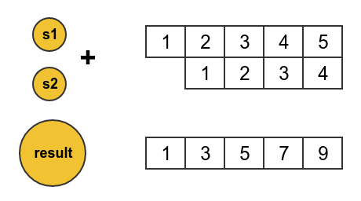
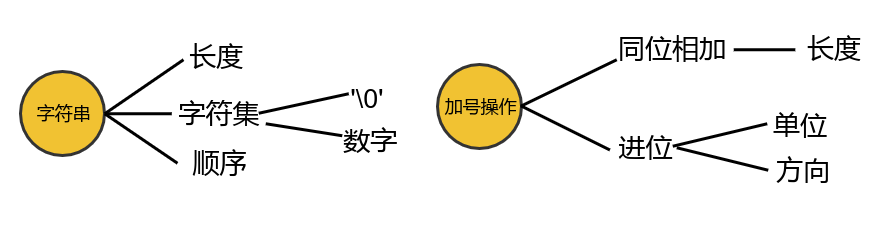
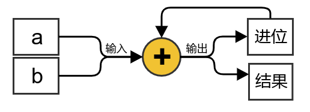
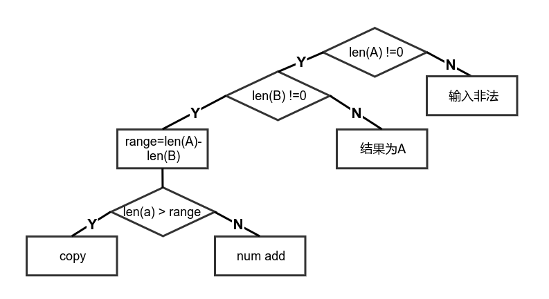

<!-- START doctoc generated TOC please keep comment here to allow auto update -->
<!-- DON'T EDIT THIS SECTION, INSTEAD RE-RUN doctoc TO UPDATE -->


- [算法的认知](#%E7%AE%97%E6%B3%95%E7%9A%84%E8%AE%A4%E7%9F%A5)
- [题目：](#%E9%A2%98%E7%9B%AE)
- [题目分析](#%E9%A2%98%E7%9B%AE%E5%88%86%E6%9E%90)
  - [物理元素分析](#%E7%89%A9%E7%90%86%E5%85%83%E7%B4%A0%E5%88%86%E6%9E%90)
    - [找出物理元素](#%E6%89%BE%E5%87%BA%E7%89%A9%E7%90%86%E5%85%83%E7%B4%A0)
    - [元素属性分析](#%E5%85%83%E7%B4%A0%E5%B1%9E%E6%80%A7%E5%88%86%E6%9E%90)
  - [逻辑关系梳理](#%E9%80%BB%E8%BE%91%E5%85%B3%E7%B3%BB%E6%A2%B3%E7%90%86)
    - [1. 变量与常量](#1-%E5%8F%98%E9%87%8F%E4%B8%8E%E5%B8%B8%E9%87%8F)
    - [2. 可能的场景](#2-%E5%8F%AF%E8%83%BD%E7%9A%84%E5%9C%BA%E6%99%AF)
    - [3. 系统边界](#3-%E7%B3%BB%E7%BB%9F%E8%BE%B9%E7%95%8C)
  - [表达的准确性](#%E8%A1%A8%E8%BE%BE%E7%9A%84%E5%87%86%E7%A1%AE%E6%80%A7)
    - [数据结构表达](#%E6%95%B0%E6%8D%AE%E7%BB%93%E6%9E%84%E8%A1%A8%E8%BE%BE)
    - [逻辑关系表达](#%E9%80%BB%E8%BE%91%E5%85%B3%E7%B3%BB%E8%A1%A8%E8%BE%BE)
- [总结](#%E6%80%BB%E7%BB%93)

<!-- END doctoc generated TOC please keep comment here to allow auto update -->

今天看到`小浩算法`打印N位数的所有值，进一步引申到`大数问题`，解决大数问题有很多种方法，
其中一个方法就是用字符串模拟数字运算。本文用字符串来模拟大数加法，并顺带的给出打印N位数
的所有数的算法实现。

# 算法的认知
算法是计算机科学中解决方案准确而完整的描述，是一系列解决问题的清晰指令，代表着用系统方法
描述解决问题的策略机制。通过对算法相关题目的分析和解答，可以有效的锻炼我们的思维能力和提
升认知思维能力,分析解决算法问题也是一个提升我们存在性认知的过程。平时的具体的思维分析方法
，也可以在算法题目中很好的运用.这也许可以认为是知行合一的体现。结合这个题目的解题过程，
我认为可以提炼出一下的思维认知模式：

1. 系统思维<br>
一个算法的题目，可以看做成一个系统。系统空间是由若干个`基本物理元素`构成，这些物理元素是系
统空间的物质范畴,物理元素又包含若干个`内部属性`，它是与其他物理元素区分和联系的重要标识。
基本物理元素之间存在着逻辑关系，我们要做的就是，梳理基本元素之间的逻辑关系，把解决方案的
逻辑关系用代码表达出来。
系统具有`递归组合`的特点，一个大的系统由若干个小的系统组成,因此从系统的角度还需要考虑到整
体与局部的问题。

2. 确定边界<br>
分清题目中的常量和变量。准确的把握常量的逻辑关系，最好可以用公式表达出来。准确的把握变量
的边界和变量之间逻辑思维边界。

3. 多角度看问题<br>
把算法题目看做一个系统，从多个角度(整体和局部，发展变化，设定条件缩小思考范围，固定逻辑)
看问题，抓住事物发展和变化的规律。

4. 表达的准确性<br>
编程是我们大脑和内心思维的表达，让计算机能够正确的执行。与我们与他人说话和表达是一个效果。
如果我们想让计算机更好的执行我们的思维，那就必须用编程语言正确的表达我们的思维。
这包含物理对象数据结构的表达和逻辑关系封装的表达。


# 题目：
给出两个数字组成的字符串，输出两个数字的和。
例如：输入字符串为 12345和1234，输出13579

# 题目分析
## 物理元素分析
### 找出物理元素
这个题目，系统组成比较简单，组成的基本物理元素有4个基本的元素：
1. 输入字符串s1
2. 输入字符串s2
3. 加号操作
4. 输出结果字符串result。
如下所示



### 元素属性分析
题目中，基本的元素可以分为两类，字符串和加号操作。如图２所示

基本元素中的`字符串`，具有`长度`，`字符集`, `顺序`的属性。

`加号操作`，具有`同位相加`和`进位`的属性。

`对应位置相加`是加号操作`子系统`中的物质元素，从`整体`上看需要知道两个数字的长度，从`局部`
基本的操作单位(对应位置相加)上看包含的逻辑关系是：
1. 两个对应位置都有元素
2. 两个对应位置只有一个有元素
3. 对应位置都没有元素（不用考虑）

<br>
加号操作的另外一个属性是`进位`，进位有两个属性进位单位和进位方向
<br>
1. 进位单位<br>
数字相加进位1，这个是单位常量<br>
2. 进位方向<br> 
进位方向，和运算方向有关，自左向右或者是自右向左。
加法的运算一般采用`自右向左`的方式，因此进位的方向就是向左进位。
关于方向，我们还需要考虑的是 进位标志的存储和下级运算对进位的处理。

## 逻辑关系梳理
上面题目中的基本元素和属性都分析完毕了。
根据物质元素，我们来根据题目，构建出解决题目的逻辑关系。

从题目的目的来看，这个题目解决方案的`基本操作`是加法操作，如下图所示：


基本操作是解决整个系统问题的基本步骤，对基本操作有下面的思考角度：
\1. 变量与常分析 2. 可能场景分析 3. 系统边界分析 <br>

### 1. 变量与常量
区分出操作的常量和变量，然后考虑变量可能的类型，把相关的类型统一分类。
对于变量找出变量变化的因素，对于常量分析出常量的一般规律，用公式表达。
对变量类型的梳理和分类有助于，清晰解题的思路，聚焦解决问题的视野。
在基本操作中，输入的a和b都是变量，加法操作的规则是常量。

### 2. 可能的场景
分析系统的变量后，根据变量的物理属性，考虑可能出现的情况(是或与，交并补)。
上面的分析输入字符串ab具有长度，字符集和顺序的属性。从`长度的角度`考虑可能的场景。<br>
以思考清晰的目，设置约束条件，减少思考的范围。我们约定字符a所在的字符串A的长度一定大于b
所在的字符串B的长度，把思考的范围，集中在A上。

A在长度可能的情况有下面几种：
_

1. len(A) = 0, 表示出现了错误的输入，不用运算。<br>
2. len(A) != 0,在这种情况下考虑len(B).<br>
   2.1 len(b) == 0, 结果就是A<br>
   2.2 len(b) != 0, 这种情况需要考虑，位置都存在和A超出B的部分。<br>
   长度相同的部分，同位相加。<br>
   长度不同的部分，等于A超出的部分和0相加。<br>

   这里需要着重考虑的是，不同情况下的边界条件和是否有`边界跨越元素`。在这里进位元素就是
   一个边界跨越元素，进位会从存在部分影响A超出B部分的计算。

### 3. 系统边界
场景分析完，接下来就是确定不同场景的边界。边界一般从物质属性边界，特殊的标识和场景中找。
在这个题目中，字符串的长度是一个物质属性，他的长度可以作为一个边界。字符串中'\0'这个特殊
的字符，作为字符串的边界。字符串中的进位作为一个特殊的场景，也可以作为边界。
系统的边界是我们在算法实现上需要考虑的重点。以进位为例子：
对于进位，我们要考虑的是
1. 进位存储
在不引起新的变量的情况下，进位可以存储在原来字符存储空间和结果存储空间中。i
考虑到进位可能增加结果字符串的长度，我们把结果存储的长度设定为len(A)+1。如i
果我们把进位存储在结果中，可以避免对原来字符的影响也可以避免数组访问越界的
问题。因此，把进位存储在结果中，是一个比较好的选择。
进位存储定义了carry_bit_oper()函数，如下
```c
static void carry_bit_oper(char * res_p, int res_turn){
        if (res_p[res_turn] > '9'){
            res_p[res_turn] -= 10;
            res_p[res_turn-1] += 1;
        }
}
```
2. 进位在下一操作中的使用
把进位存储在结果的存储空间中，进行下一步的操作中，我们就可以对result[i+1]直接进行加等的
操作。进位属于跨界元素，需要考虑在跨界元素左右场景下的使用。
1. 左场景：位置都存在 <br>
    加等AB都存在的字符，判断进位标志
2. 右场景：A超出B的部分 <br>
   加等A中存在的字符，判断进位标志
进位累加操作在不同的场景中属于同类操作，划分层次即可，实现代码在char_num_oper()函数中
```c
//同位操作
    for ( i = 0; i < elems->len2; i++){
        res_turn = elems->res_len  -i; 
        res_p[res_turn] += (elems->s1[elems->len1-i-1] + elems->s2[elems->len2 -i -1 ] - zero);
        carry_bit_oper(res_p, res_turn);
    }
    //超出部分操作
    if ((elems->len1- elems->len2) > 0){
        res_turn--;
        while(res_turn > 0){
            res_p[res_turn] += +elems->s1[res_turn-1];
            carry_bit_oper(res_p, res_turn);
            res_turn--;
        }
    }
```
## 表达的准确性
表达的准确性包含物理对象数据结构的表达和逻辑关系的表达。数据结构的表达要尽可能的表达对象
的最根本的含义，尽可能的包含对象内部的逻辑关系。逻辑关系的表达，要符合逻辑结构清晰，高内聚
低耦合的要求。
### 数据结构表达
在场景分析中提到，为了聚焦逻辑思考的对象，我们做了约定，把思考的范围集中在Ａ字符串上。
在算法的实现中，定义了下面的对象，用于表达原始的输入对象。
```c
typedef struct elem_len{
    oper_type_t type;
    char * s1; //指向长度长的字符串
    char * s2; //指向长度短的字符串
    int len1;　//长的字符串的长度
    int len2;　//短的字符串的长度
    int res_len;　//结果字符串的长度
}elem_len_t;
```
这里构建一个符合处理逻辑的结构elem_len_t，增加存储结构, 增加s1和s2的指针，s1指向的字符
串的长度大于s2的长度。把长度单独定义一个对象，把所有的长度包含在里面，防止长度的重复计
算。这个结构体，内部自包含逻辑性, 使用数据结构自身的属性反映系统内部事物的逻辑。同时定
义了length_charge()函数，把外界无逻辑的对象，转化为内部自包含逻辑的对象elems,函数输出具
有内部逻辑属性的新对象.后面的计算以新对象为操作对象。内聚，体现事物的本质属性, 使事物表
现出一种逻辑的组合关系。

### 逻辑关系表达
逻辑关系的表达，有同类功能划分层次、不同功能划分模块、 关键路径建环路等方法。
在算法的实现上，long_num_add()函数根据输入元素的类型，用switch语句，进入不同的层次结构。针对元素转
换、结果输出、元素操作分别定了相关的处理函数，函数之间保证模块单元操作最小化，代码重复量
小，功能交叉性低。针对内存的分配和释放操作，建立操作的环路，保证申请的内存被释放。

# 总结
解决问题的过程是提升我们存在性认知的过程，存在性认知是主观与客观的高度统一，是认识论与本体论的
微妙结合。本文通过对“大数相加”问题的求解，首先分析了该系统中存在的基本元素和元素的属性，然后
在逻辑的角度，区分了系统中的常量和变量，对常量的部分总结出了公式模型，对变量部分找出了可能的场景，
定义了变量变化的边界。整个过程为算法问题的解决，提供了一种思考的方法。最后对代码的表达实现阐述了
自己的观点。具体的代码试在
[code](https://github.com/linengier/big_algorithm/blob/master/1.big_num_add/long_num_char.c)。
